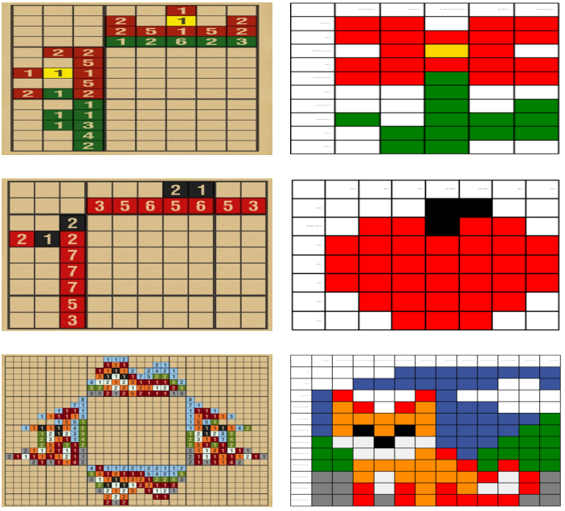

# Prolog and Nonograms

This repository compiles a Prolog solution to the nonogram problem. Specifically, to those nonograms present on the CrossMeColors mobile application.

To use it, it is just necessary to add a json file with the board information. Then change main.py to use the file you have just created.

The python code is provided only for visualization, as it is easier to understand an image than a Prolog standard output. I use the term output although Prolog 
does not have and input/output concept. For this specific problem, it is just the way to indicating the predicate that it is used to save the final solutions.

